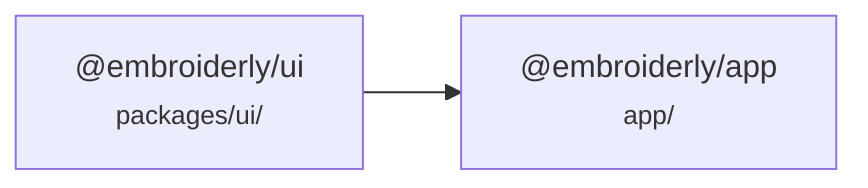
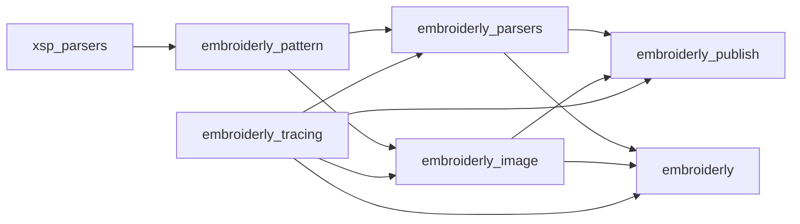

# Verify

After finishing code changes, run the verification pipeline to ensure quality.
The goal is to catch issues early without doing more work than necessary.

---

## Project structure

### TypeScript packages

| Package            | Path           |
| ------------------ | -------------- |
| `@embroiderly/ui`  | `packages/ui/` |
| `@embroiderly/app` | `app/`         |



### Rust crates

| Crate                 | Path                          |
| --------------------- | ----------------------------- |
| `embroiderly`         | `app/src-tauri/`              |
| `embroiderly_image`   | `crates/embroiderly-image/`   |
| `embroiderly_parsers` | `crates/embroiderly-parsers/` |
| `embroiderly_pattern` | `crates/embroiderly-pattern/` |
| `embroiderly_publish` | `crates/embroiderly-publish/` |
| `embroiderly_tracing` | `crates/embroiderly-tracing/` |
| `xsp_parsers`         | `crates/xsp-parsers/`         |



**Scoping principle:** always target the narrowest set of packages/crates that covers the changes plus their dependents.
When the scope is broad or uncertain, run the workspace-wide command.

---

## Step 1. Type checking

```bash
pnpm [-F <package>] check-types
cargo check --locked [-p <crate>]
```

## Step 2. Linting and Formatting

**Frontend:**

```bash
pnpm lint:fix
pnpm fmt:fix
```

**Backend:**

```bash
cargo clippy --locked --fix --allow-dirty -- -D warnings
cargo +nightly fmt
```

Run both if you changed both sides.
This fixes trivial issues and reports non-fixable issues inline.

## Step 3. Testing

**Frontend:** `app/` has separate `test:unit` (logic) and `test:components` (Vue components) scripts.
Run only what's relevant.
Skip `test:e2e` unless the change touched Tauri commands, IPC, or window behavior, as it requires a running Tauri instance.

```bash
pnpm -F <package> test
```

**Backend:** all tests require `-F embroiderly/test`.

```bash
cargo nextest run --locked --no-fail-fast -F embroiderly/test [-p <crate>]
```
