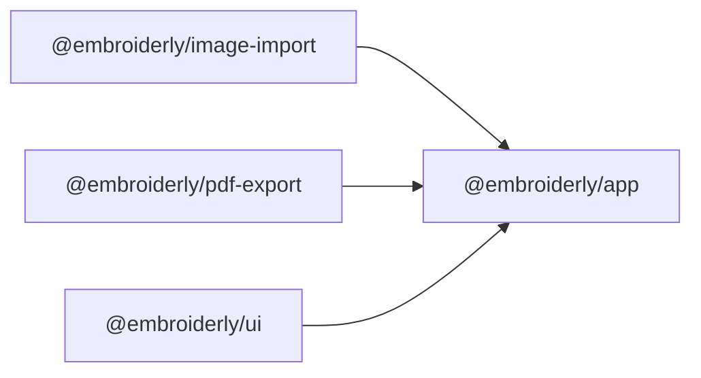

# Verify

After finishing code changes, run the verification pipeline to ensure quality.
The goal is to catch issues early without doing more work than necessary.

---

## Project structure

**Scoping principle:** always target the narrowest set of packages/crates that covers the changes plus their dependents.
When the scope is broad or uncertain, run the workspace-wide command.

### TypeScript packages

| Package                     | Path                     |
| --------------------------- | ------------------------ |
| `@embroiderly/app`          | `app/`                   |
| `@embroiderly/image-import` | `packages/image-import/` |
| `@embroiderly/pdf-export`   | `packages/pdf-export/`   |
| `@embroiderly/ui`           | `packages/ui/`           |



### Rust crates

| Crate                 | Path                          |
| --------------------- | ----------------------------- |
| `embroiderly`         | `app/src-tauri/`              |
| `embroiderly_editor`  | `crates/embroiderly-editor/`  |
| `embroiderly_image`   | `crates/embroiderly-image/`   |
| `embroiderly_parsers` | `crates/embroiderly-parsers/` |
| `embroiderly_pattern` | `crates/embroiderly-pattern/` |
| `embroiderly_tracing` | `crates/embroiderly-tracing/` |
| `embroiderly_web`     | `crates/embroiderly-web/`     |

### Wasm modules

Each Wasm module lives in a `src-wasm/` subdirectory and exposes autogenerated TypeScript bindings via its `pkg/` directory.

| Module                     | Path                              | Consumed by                 |
| -------------------------- | --------------------------------- | --------------------------- |
| `embroiderly_wasm`         | `app/src-wasm/`                   | `@embroiderly/app`          |
| `embroiderly_image_import` | `packages/image-import/src-wasm/` | `@embroiderly/image-import` |
| `embroiderly_pdf_export`   | `packages/pdf-export/src-wasm/`   | `@embroiderly/pdf-export`   |

---

## Step 0. Build Wasm modules

Type checking requires the autogenerated TypeScript bindings in each Wasm module's `pkg/` directory.
Build only the Wasm modules whose Rust sources changed, using dev mode.

```bash
pnpm -F <package> wasm:build-dev # or `pnpm -r wasm:build-dev` to build all three Wasm module.
```

Skip this step if only TypeScript sources changed and all `pkg/` directories already exist from a previous build.

## Step 1. Type checking

```bash
pnpm [-F <package>] check-types
cargo check --locked [-p <crate>]
```

## Step 2. Linting and Formatting

**Frontend:**

```bash
pnpm lint:fix
pnpm fmt:fix
```

**Backend:**

```bash
cargo clippy --locked --fix --allow-dirty -- -D warnings
cargo +nightly fmt
```

Run both if you changed both sides.
This fixes trivial issues and reports non-fixable issues inline.

## Step 3. Testing

**Frontend:** `app/` has separate `test:unit` (logic) and `test:components` (Vue components) scripts.
Run only what's relevant.

```bash
pnpm [-F <package>] test
```

**Backend:**

```bash
cargo nextest run --locked --no-fail-fast [-p <crate>]
```
