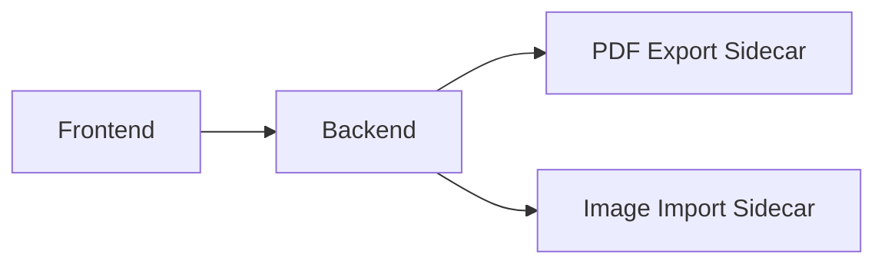

# Embroiderly Architecture

Embroiderly is a desktop application built with [Tauri](https://tauri.app), [Vue.js](https://vuejs.org), and [Pixi.js](https://pixijs.com).
In general, the application is composed of a web frontend and Rust backend.

> In case of Tauri applications, the _backend_ is local.

The application frontend is a thin client though it contains a complex UI logic.
Its main purpose is to provide a UI, render patterns, and handle the user input.
The only source of truth is the Rust backend.

The application backend consists of the core module, which defines core entities and contains the business logic, and several [sidecars](https://tauri.app/develop/sidecar).

The sidecars are used to extract heavy and specific tasks into dedicated programs.
At the moment of writing this document, there are two sidecars: PDF Export sidecar and Image Import sidecar.
**Important:** Sidecars are an implementation detail so they should not be directly exposed to the frontend.

